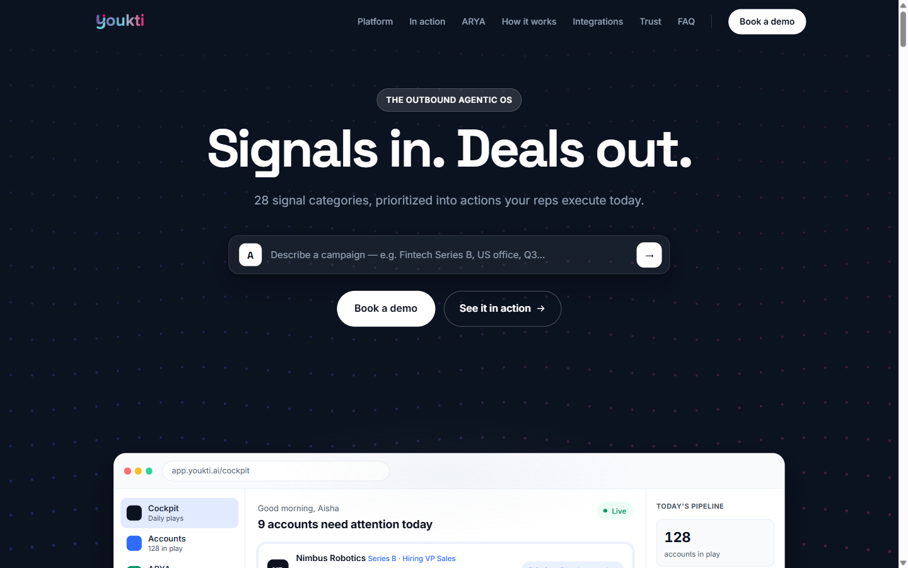
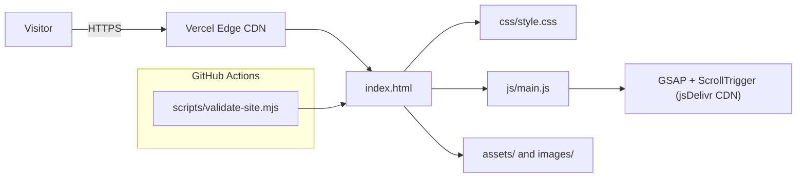

# Youkti — Teaser Site

> A hand-built, animation-heavy marketing site for an AI-native B2B sales platform. No framework, no build step.

[](https://github.com/AkashNaickar/youkti-teaser/actions/workflows/ci.yml)
[](LICENSE)
[](https://youkti-teaser.vercel.app/)

**[Live demo →](https://youkti-teaser.vercel.app/)**



## About this project

I designed and built this teaser site from scratch as a frontend/motion-design portfolio piece. The concept is **Youkti.ai**, an "outbound agentic OS" for B2B sales with a GTM agent named ARYA. The goal was to make that pitch feel like a product rather than marketing copy.

This is an independent concept teaser. It is not affiliated with, sponsored by, or endorsed by Youkti, and the copy is not the company's official marketing material.

## Features

All of the following are implemented and verified on the live site:

- **Interactive ARYA prompt** in the hero. Type a campaign description and it renders a populated cockpit result (accounts, match reasons, priorities).
- **Hand-coded cockpit mockup** with account rows, ARYA suggestions, pipeline stats, and a signal watchlist — pure HTML/CSS, not a screenshot.
- **Pinned-scroll walkthrough** that scrubs through four product screenshots as you scroll.
- **Four product mini-demos** (Execute, Account Research, Outreach Automation, Competitive Intelligence) as self-contained CSS/JS loops.
- **ARYA section** with an auto-playing chat demo, typewriter text, and a replay control.
- **Trust band**: animated counters, personas, an integrations grid, a proof spotlight, an FAQ accordion, video testimonials, a CTA, and a footer.
- **Motion layer** built on GSAP + ScrollTrigger, plus a Canvas 2D hero background and a desktop custom cursor.
- **Degrades cleanly**: every GSAP effect has a no-JS / `prefers-reduced-motion` fallback, and the layout works with animations disabled.

## Tech stack

| Layer | Tech |
|-------|------|
| Markup | Single-file semantic HTML5 (`index.html`) |
| Styling | Hand-written CSS with custom properties (`css/style.css`) |
| Motion | GSAP 3.12 + ScrollTrigger (jsDelivr CDN), Canvas 2D |
| Scripting | Vanilla JavaScript, no framework or bundler (`js/main.js`) |
| CI | GitHub Actions running `scripts/validate-site.mjs` + gitleaks |
| Hosting | Vercel (static, immutable caching for `/assets`) |

## Architecture



## Quick start

> These commands were executed from a clean clone.

There is nothing to install or build — it is plain static files. Serve the folder with any static server:

```bash
git clone https://github.com/AkashNaickar/youkti-teaser.git
cd youkti-teaser
python -m http.server 8080
# then open http://localhost:8080
```

Any equivalent works too:

```bash
npx serve .
```

## Configuration

None. This is a static site with no environment variables, API keys, or runtime secrets.

## Testing

The CI check validates the HTML document, that every local `href`/`src` resolves to a real file, that every same-page anchor has a matching `id`, that there are no duplicate ids, and that every `` has an `alt` attribute. It has no dependencies and no network access:

```bash
node scripts/validate-site.mjs
# PASS: index.html valid — 15 ids, 27 local refs, 10 anchors checked
```

Run it locally before pushing; it is the same command CI runs.

## Deployment

Deployed to **Vercel** as a static site at <https://youkti-teaser.vercel.app/>. The project is linked as `youkti-teaser`; deploy a production build with:

```bash
vercel --yes --prod
```

`vercel.json` sets `Cache-Control: public, max-age=31536000, immutable` for `/assets/*`, so product screenshots and logos are served from the edge cache.

## Roadmap

- [ ] Self-host the Inter and Space Grotesk fonts to remove the Google Fonts dependency.
- [ ] Add a Lighthouse CI budget (performance and accessibility) to the workflow.
- [ ] Add automated accessibility checks (axe) to CI.

## Contributing

Issues and PRs are welcome. Please run `node scripts/validate-site.mjs` before opening a PR.

## License

MIT — see [LICENSE](LICENSE).
